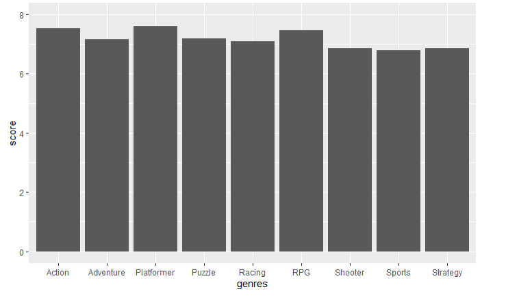

Motivation

I have played video games for most of my life but have never done and looking into the best genre or what the best title is. I may not have gone out of my way to find the best 
of the best of the the samepl size I have for this project I wanted to answer some questions about the video game industry. The couple questions I had in mind are:
Based on IGN reviews what genre seemed to have the overall better reviews.
What game title had the best over all review from the sample i had chosen

Data Process

I went through IGN and grabbed the scores, titles ,genre and the person who left the review and looked up developers and publishers to round out the set. At the end if there were
blanks I would either remove them or go back and find the missing piece. I also would make judgement calls on the genre i didnt want too many and tried to keep them limited.
After using my best judgement to decide a single genre i went through and removed games that belonged to a genre that only had 1-9 titles to try and keep the data small and simple
Other than that this data did not need to much cleaning before it could be used

Vizualization

Ratings for genre

Average of the genre ratings

Out of my sample it looks like:
Action and shooter had the highest ratings overall but platformer just squeeked by with the average(this probably due to not equal amounts of genre in this sample)

And from here you can see that there are 3 games that got the highest base review

Analysis

I used Tukey's 5 numbers to find the important values for the scoring. The numbers i got were 
2 6 7 8 10

This showed me that the lowest score was a 2, The lower-hinge was a 6, the median was a score of 7, the upper hinge was an 8, and the max was a 10

Out of the sample set I had it was interesting to see that nothing really score too low. The lowest was a 2 but that was only on review and the median was a 6.
So most of the games that got reviews did atleast better than a 5.
